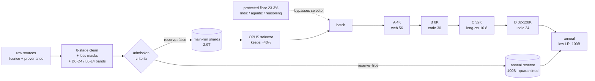

# V5 Data Mixture and Curriculum — a specification

**ERA V5, Session 5.** The plan for what the 40B India-first model sees, how much of it, and in
what order — written so that every number can be attacked, and so that attacking it is cheap.

Three commitments run through this document:

1. **No number is asserted without its supply.** Every lane share is checked against real unique
   token supply and converted into an epoch count. A share that needs more than 4 epochs is either
   cut or explicitly manufactured, and it says which.
2. **Every number is produced by a script here, and a test fails if it stops adding up.**
   [`scripts/03_solve_mixture.py`](scripts/03_solve_mixture.py) reads the spec, checks a dozen
   invariants and exits non-zero if one breaks. The tables below are its output, not typing.
3. **The plan is a hypothesis with a kill condition.** §8 pre-registers the 1B/3B proxy, the metric
   that confirms it and the result that refutes it — then reports the two reduced proxies that were
   actually run here. **This mixture placed 4th of 6 in the first and last of 4 in the second**, and
   the second one refuted the prediction I had written down in advance about my own agentic share.
   Both results are in §8.2–8.3 with their diagnoses and the three protocol fixes they forced, not
   buried.

| | |
|---|---|
| Model | 40B dense, 200k vocab, tied embeddings (carried over from the Session-3 strategy report) |
| Budget | **3.0T tokens** = 2.9T main run + **100B anneal reserve** |
| Hard rule | **≤ 4 epochs on any lane** ([arXiv:2305.16264](https://arxiv.org/abs/2305.16264)) |
| Protected floor | **90% of the scheduled share** of Indic + agentic + reasoning — **23.3%** of every batch, set from measured selector retention (§5) |
| Spec | [`mixture/v5_mixture.json`](mixture/v5_mixture.json) · [`mixture/inventory.json`](mixture/inventory.json) |
| Generated reports | [mixture](results/mixture_report.md) · [proxy](results/proxy_report.md) · [selector](results/selector_report.md) · [bands](results/band_examples.md) · [cleaning](results/cleaning_report.md) |

**The three numbers a reviewer should attack first**, and where they are answered:
the agentic lane is 0.96% and 94% synthetic (§2, §4.1); the Indic verified tier is 28% and not the
composer's 40% (§3); the anneal reserve is 100B, and when its admission criteria were applied to
real cleaned documents the two lanes this model exists for came back at **0.6%** and **0%** fill
(§6, §9) — the reserve's hardest problem is manufacturing, not selection.



---

## 1. The budget, and the one rule that makes the rest honest

The session sets the run at 2.4–4T tokens. We take **3.0T**, split **2.9T main run + 100B anneal
reserve** (3.3%; the session's lifecycle panel puts mid-training at ~2%, OLMo-2-class recipes at
~5%, and §6 justifies the exact size by what the reserve can actually be *filled* with).

The rule that stops every later number from being a wish: **no lane may exceed 4 epochs over its
unique supply.** Muennighoff et al. show that up to 4 epochs of repeated data costs almost nothing
against fresh data, and past that the value of added compute decays toward zero. So a lane share is
legitimate if and only if

```
share × 3.0T  ≤  4 × (collected unique tokens + tokens we have costed a way to manufacture)
```

When a share fails that test the share is cut. The cap is never raised. That single asymmetry is
what separates this from a spreadsheet of round numbers.

---

## 2. The mixture

Seven lanes, 100% of the main run. Shares are **not** round because they are the token-weighted
integral of the stage schedule in §7 — the curriculum is the primary object and the headline share
is derived from it.

| lane | share | main-run | anneal | total demand | unique supply | epochs | verdict |
|---|---:|---:|---:|---:|---:|---:|---|
| general web | **31.03%** | 900.0B | 6.0B | 906.0B | 4.50T | 0.20 | covered |
| code | **24.00%** | 696.0B | 18.0B | 714.0B | 1.10T | 0.65 | covered |
| Indic | **17.90%** | 519.0B | 22.0B | 541.0B | 276.0B | 1.96 | needs repetition |
| STEM / math | **11.52%** | 334.0B | 14.0B | 348.0B | 250.0B | 1.39 | needs repetition |
| long context | **7.56%** | 219.1B | 12.0B | 231.1B | 100.0B | 2.31 | needs repetition |
| reasoning | **7.03%** | 204.0B | 18.0B | 222.0B | 85.0B | 2.61 | needs repetition |
| agentic | **0.96%** | 27.9B | 10.0B | 37.9B | **10.6B** | 3.57 | **94% manufactured** |

Supply figures are the Session-5 Dataset Inventory's lane totals; the per-dataset breakdown behind
each, with an evidence tag on every line (`[course]`, `[paper]`, `[estimate]`, `[measured]`), is in
[`mixture/inventory.json`](mixture/inventory.json).

### Why each number is that number

**General web 31%** — the largest lane, and the one I most expected to want to cut. It stays large
for two reasons. The session's own example (*"famous people born when their mothers were over 40"*)
is a fact that exists only in the long tail of the web; no curated corpus contains it. And RegMix
reports the uncomfortable empirical finding that **web corpora, not curated "high-quality" sets,
correlate most strongly with downstream performance**. Cutting web hard is a real risk, not a free
win. What we do instead is *fade* it: 56% → 11.5% across the four stages, mirroring V4's 72 → 18.
Buys MMLU, ARC, TriviaQA. **This is the weakest number in the plan and §8.2 says why**: the proxy
measured web as the flattest of the large lanes (elasticity −0.214 vs code's −0.543), i.e. the
cheapest to cut in loss terms. Loss is not the benchmark, so this is not yet a refutation — but web
31% is the first thing the 1B runs are pointed at.

**Code 24%** — target capability #1 and the only large lane where supply is not binding (1.1T
unique, 0.65 epochs, every token fresh). V4 ended at 35%; we integrate to 24% because the model also
has Indic duty, and because the failure mode of a code-saturated model is the one the session
described: it can program anything and has no common sense. The shape matters as much as the share
— file-level source, PR/issue threads, and **commit diffs**, because a diff is the training shape
that matches Aider Polyglot's metric. Buys LiveCodeBench, Aider, Codeforces, HumanEval+.

**Indic 17.9%** — the differentiator, third-largest share, largest protected floor. Not 25%: the
lane as a whole would still fit, but the *verified* tier would need >4 epochs or be diluted with
translated text until the model learns translationese rather than an Indian language. §3 prices the
tiers separately, which is where that constraint actually lives. Buys MILU, IndicGenBench,
FLORES-200 Indic, Belebele Indic.

**STEM/math 11.5%** — highest signal density per token, but also the lane whose supply we would
exhaust fastest. V4 ended at 39%; sustained across our main run that would be 1.13T against 250B
unique = 4.5 epochs, over the cap. We ramp 6% → 14% and hold, and push the scarce top of the distribution (proofs,
olympiad, PhD-grade) into the anneal rather than burning it early. Buys GPQA, MMLU-Pro STEM.

**Long context 7.56%** — not a lane you sprinkle. Each sample is longer, batches must be
length-homogeneous (you cannot put a 4K and a 32K sample in one batch), and a short sample in a long
batch is wasted compute. So the share is *concentrated*: 2.5 / 3.0 / 16.8 / 13.0 across stages,
almost all of it after the model can already read and reason. Repo-level packs are the majority,
because that is the context shape SWE-bench actually presents. Buys RULER, long-eval, and the
context half of SWE-bench.

**Reasoning 7.03%** — 2.61 epochs, inside the cap with no slack, which is why it is protected. The
session is explicit that reasoning is *taught later* (SFT then RLVR, sessions 17–18). Pretraining's
job here is to install the structure of a worked multi-step argument so that the later stage has
something to sharpen; 7% buys that structure across the length bands in §7.3. Buys AIME, GPQA, HLE —
indirectly, by making the later stages possible.

**Agentic 0.96%** — argued in full below, because it is the number most likely to be challenged.

---

## 3. The Indic slot, split across its four provenance tiers

| tier | main-run share | anneal share | demand | collected | + elastic capacity | epochs |
|---|---:|---:|---:|---:|---:|---:|
| **A — verified native** | 28% | 70% | 160.7B | 60.0B | 85.0B | 1.89 |
| **B — unverified crawl** | 30% | 5% | 156.8B | 135.0B | 135.0B | 1.16 |
| **C — translated / transliterated** | 24% | 10% | 126.8B | 45.0B | 125.0B | 1.01 |
| **D — synthetic** | 18% | 15% | 96.7B | 36.0B | 96.0B | 1.01 |

**Why not the composer's 40/25/20/15.** 40% verified is 208B of main-run demand against ~85B of
verified supply *after* the collection programme below — 2.4 epochs in the main run alone, before
the anneal takes its share. It does not fit. So the main run takes **28% verified**, and the anneal
runs **70% verified**: the best Indic tokens are spent at low learning rate on a model that can use
them, which is the entire argument for having a reserve.

**Tier A is capped by supply, not by preference**, and the way to raise it is to raise supply. The
collection programme that takes verified Indic from 60B to 85B, in priority order: Indic Wikipedia
full dumps (~1.5B, done — 49MB of 12 languages pulled and cleaned in this repo), central and state
government portals, gazettes and judicial text (~6B, also the best long-context Indic we have),
NCERT and state-board material plus open courseware (~2B), licensed regional news archives (~10B),
and parliamentary and public-broadcast transcripts (~5B). If it lands under 70B, **Tier A drops to
22% and Tier B absorbs it — C and D are not raised**, because translationese is precisely the
failure this split exists to prevent.

**C + D ≤ 42% of the lane** is a hard constraint the solver enforces. Both tiers are elastic — we
can manufacture them at translation and generation cost — which is exactly why they need a ceiling
rather than a floor. Their capacity is also at 1.01 epochs, i.e. *fully consumed*: a 10% shortfall
in translation throughput is absorbed by Tier B, never by Tier A.

### 3.1 Which languages, and when — including the Sanskrit question

Shares within the Indic lane, carried forward from the S3 language allocation and renormalised to
the lane. All twelve plus Hinglish enter at **stage A**, not later: script and morphology have to be
learned while the embedding table is still plastic, and V4's gradient incident came precisely from
raising an Indic share late against settled embeddings.

| | languages | share of Indic lane | tokens (of 519B) | note |
|---|---|---:|---:|---|
| Tier 1 | Hindi 26.6, Hinglish 10.1 | **36.7%** | 190B | Hinglish is a first-class lane member, not a contaminant — it is how a large fraction of Indian users actually type |
| Tier 2 | Bengali 9.4, Tamil 8.6, Telugu 8.6, Marathi 7.0 | **33.6%** | 174B | verified supply is adequate at ≤2 epochs |
| Tier 3 | Malayalam 5.7, Gujarati 5.4, Kannada 5.4, Punjabi 3.9, Urdu 3.9 | **24.3%** | 126B | Urdu carries the RTL Perso-Arabic case; its share is protected against being absorbed by Hindi on the argument that the two "sound similar" |
| Tier 4 | Odia 3.1, Assamese 2.3 | **5.4%** | 28B | reached by upsampling, capped at 4 epochs; the ceiling here is collection, and stage D raises their weight rather than their repetition |

**Sanskrit gets 0% of the main run, deliberately, and the rule is general.** A language earns a
funded pretraining slice when it has **≥1B unique verified tokens**; below that threshold, a
pretraining share only buys repetition of a small corpus, which is memorisation rather than
competence. Sanskrit does not clear it. What it gets instead: (a) representation in the tokenizer's
language-balanced training sample, so Devanagari conjuncts common to Sanskrit and Hindi are
segmented well; (b) **0.2B tokens inside the anneal reserve** (Sanskrit Wikipedia, GRETIL/DCS
digitised texts, public-domain editions) for classical and etymological grounding at a point where
the model can generalise from small data; and (c) a place in evaluation. The same rule governs every
other Indian language not in the twelve — Maithili, Konkani, Dogri, Santali and the rest are
collection targets and evaluation targets now, and pretraining lanes when and only when the
threshold is met.

**Measured, from this repo:** the S5 cleaning pass produced 13.6M tokens of verified-native Indic
across all 12 languages, of which **78.8% qualifies for the anneal reserve** on the criteria in §6 —
a reminder that the constraint on Tier A is acquisition, not quality gating.
Fertility on our 32k proxy tokenizer ranged from **1.98 (Urdu) to 7.48 (Malayalam)** tokens/word
against 1.81 for English, which is the fertility tax S3's 200k vocab exists to pay down, and the
reason the Indic lane's real cost in this budget is measured in tokens rather than words.

---

## 4. The three scarce lanes, named, with the datasets that fill them

### 4.1 Agentic — 0.96%, and why it is not 2%

The arithmetic, in full, because this is the number to attack:

```
collected unique agentic supply                                 0.63B
+ synthesis programme, costed per environment family           10.00B
                                                              -------
  unique supply                                                10.63B
  × 4-epoch cap                                        max     42.50B
  spent: main run 27.9B + anneal 10.0B                         37.90B   → 3.57 epochs ✓
  the composer's 2% default would spend                        68.00B   → 6.4 epochs ✗
```

The synthesis programme is costed per environment family rather than as one round number, because
the binding resource is *verified environments*, not generation FLOPs: repo-level tasks from
permissive GitHub repos that have CI (300k × 9k = 2.7B), terminal/shell sandbox tasks (250k × 4k =
1.0B), API calls against mock REST services generated from OpenAPI specs (600k × 3k = 1.8B), browse
tasks against a cached web snapshot (150k × 12k = 1.8B), and multi-turn policy/user-simulation in
the tau-bench shape including Hindi and Hinglish user sims (400k × 6k = 2.4B). A trajectory is kept
only if the environment confirms the outcome the trace claims. **Gate:** under 7B delivered at
D-30, the main-run share falls to 0.7% and the anneal's 10B is protected first.

**What fills it:** ToolBench (120k samples / 80M tokens — 16,464 real REST APIs), Gorilla APIBench +
OpenFunctions + BFCL v3/v4, xLAM (licence needs a per-split check), SWE-Gym / SWE-smith-style
repo-task trajectories, and terminal/OS/web-agent traces. **Targets:** SWE-bench Verified/Live/Pro,
Terminal-Bench, tau2-bench, BFCL, WebArena/WorkArena, GAIA, BrowseComp, OSWorld.

**Two things this lane forces into the spec:**

*The masking convention.* Loss falls on the model's planning, tool calls and final answer. Tool
observations, repo files and test output are context and carry **no token loss**; the verifier's
pass/fail is reward-only. Training on observations teaches the model to invent tool results instead
of calling the tool.

*Supervised tokens ≠ tokens.* We cleaned 27,056 real trajectories in this repo and measured the
split: **38.4% of agentic tokens carry loss**. The other 61.6% are tool schemas, user turns and
observation slots. A lane sized from raw dataset bytes over-counts its learning signal by **2.6×**.
Lane shares in this spec are in *consumed* tokens (what the run pays for in compute), and this ratio
is why the agentic lane's compute cost and its training signal must be tracked separately.

**And the honest conclusion:** agentic capability is not bought in pretraining. Pretraining installs
the *format* — action/observation alternation, tool-call syntax, failure-and-recovery structure.
SWE-bench is won in SFT and RLVR, where 10–20B tokens is a large budget rather than a rounding
error. A 2% pretraining share would be paying six epochs for a format lesson.

### 4.2 Reasoning — 7.03%, and a band that does not exist

**What fills it:** OpenThoughts-3 / OpenR1-Math / OpenMathReasoning (~40B), Nemotron post-training
reasoning splits (~30B), NuminaMath 1.5 and worked-solution corpora (~8B), PRM800K (step-level
labelled CoT), GSM8K train + socratic. **Targets:** AIME, MATH-500, GPQA, HLE, and the effort dial
itself.

**Measured finding that changed the plan.** We cleaned 140MB of PRM800K and all of GSM8K. Two
numbers came back:

- **75% of PRM800K was dropped** — 20,056 of 26,551 records contain at least one step a human rated
  negatively. "85B of reasoning supply" is a gross number; at verified-step quality it is a fraction
  of that.
- **Zero of the 20,753 surviving traces reach band L3** (≥1024 reasoning tokens). The open,
  reachable reasoning corpus is entirely short and medium. The long half of this lane **does not
  exist and has to be distilled** — sample a teacher at increasing effort on problems with
  independently checkable answers, keep only answer-verified traces, and deliberately keep the
  failed branches that were later corrected, because those are what teach self-correction. Costed
  at 25B; if it delivers under 15B, L3+L4 drops from 28% of the lane to 18% and the difference goes
  to L2. A shallower model beats one trained on unverified long traces.

### 4.3 Long context — 7.56%

**What fills it:** repo-level packs (~40B, built by us from the code lane — the majority, because it
is the only long-context shape that matches SWE-bench), books (~25B), arXiv, Indian court judgments
and gazettes (~25B, which double as Tier-A Indic), and multi-doc synthetic needle/aggregation tasks
(~10B). **Targets:** RULER, long-eval, and repo-scale SWE tasks.

Packing is re-composition of tokens we already own, so **packed tokens are not new unique tokens**
and are charged to their source lane's epoch budget. That is a rule the solver enforces and it is
easy to cheat by accident.

---

## 5. The protected always-on floor

**90% of the scheduled share of Indic, agentic and reasoning is exempt from the selector in every
stage — 23.3% of every batch at run average.** V4 ran 8%, Indic only.

That is not the number this section originally carried. I wrote "Indic ≥ 12% + agentic ≥ 0.5% +
long reasoning ≥ 2% = 14.5%", which felt proportionate. Then I measured it.

[`scripts/05_selector_floor.py`](scripts/05_selector_floor.py) builds an OPUS-shaped selector on the
cleaned corpus: a proxy gradient direction from general web 45% / code 40% / STEM 15% — the
English-and-code weighting the session describes — a first-order utility score `g_batch · g_proxy`
for every candidate, and top-40% retention (V4's fraction). It runs twice: once scoring the **first
500 tokens** of a document, once scoring a window from anywhere in the same documents.

| lane | retained, prefix-500 | retained, full document | scheduled | realized (prefix) |
|---|---:|---:|---:|---:|
| general web | 93.3% | 70.0% | 31.0% | **51.2%** |
| STEM / math | 81.1% | 47.8% | 11.5% | 16.5% |
| code | 68.9% | 64.4% | 24.0% | 29.3% |
| reasoning | 22.2% | 15.6% | 7.0% | 2.8% |
| agentic | 14.4% | 3.3% | 1.0% | 0.3% |
| long context | **0.0%** | **77.8%** | 7.6% | 0.0% |
| **Indic** | **0.0%** | **1.1%** | 17.9% | **0.0%** |

Two things fall out of this that no amount of arguing would have produced.

**The selector does not under-value Indic. It erases it.** Zero of 90 Indic candidate batches
survive top-40% selection against an English-and-code proxy; the realized Indic share is 0.0%
against a 17.9% schedule. A 12% absolute floor would have delivered exactly 12% — a 5.9-point
shortfall in every batch, compounding across 2.9T tokens. So the floor cannot be an absolute number
below the schedule; it has to be a *fraction of the schedule*. At measured retention, holding
realized share within 10% of scheduled needs ~90% of the lane protected, and that is now the rule.

**The 500-token prefix is not a detail — for long documents it is the entire outcome.**
Long-context candidates retain **0.0%** when the scorer sees a document's first 500 tokens and
**77.8%** when it sees a window from anywhere in the same documents. Same data, same proxy, same
model; a 78-point swing from where the scorer looks. This is the session's claim about agentic
trajectories, measured — and it generalises to every lane whose payload is not in the opening lines.

**The cost, stated plainly.** Protecting ~23% of every batch leaves OPUS's efficiency gain applying
to ~77% of it, against ~92% under V4's 8% floor. That is a real price and I am paying it knowingly.
The trigger to lower it is written down: if the production proxy is measured to retain Indic above
30% — because it carries MILU/IndicGenBench gradients, which mine deliberately did not — re-derive
the fraction from that measurement. The rule is *protect what the selector demonstrably rejects*,
not *protect 90%*.

Full output: [`results/selector_report.md`](results/selector_report.md).

---

## 6. The anneal reserve

**100B tokens, declared now and quarantined at manifest level.** A shard admitted to the reserve
carries `reserve=true` and is excluded from the main-run dataloader entirely — not down-weighted,
excluded. Re-admission needs a manifest change and a signed reason. If a reserve shard shows up in a
main-run manifest it is treated as an incident and the shard is *burned*, not re-quarantined: its
value was in being unseen. The quarantine is implemented, not described: the cleaning pass writes
`data/clean/<lane>_RESERVE.jsonl` as a **physically separate shard** with its own manifest entry and
content hash, so the main-run dataloader cannot reach it by mis-weighting a sampler.

| lane | share | tokens | admission criterion (abridged) |
|---|---:|---:|---|
| Indic | 22% | 22.0B | native-speaker verified, attributable, no translationese, not in any Indic benchmark's source pool |
| code | 18% | 18.0B | repo-level context with a test suite that passes at the recorded commit |
| reasoning | 18% | 18.0B | verified answer, band L3/L4, contains an explicit check or self-correction |
| STEM/math | 14% | 14.0B | textbook, proof or olympiad grade with a resolvable claim |
| long context | 12% | 12.0B | single documents of 64k–128k tokens — real long documents, not concatenations |
| agentic | 10% | 10.0B | ≥3 tool calls, ≥1 failure-and-recovery turn, verified against real environment ground truth |
| general web | 6% | 6.0B | reference-grade only: encyclopaedic, institutional, dated, attributable |

Reserve Indic runs **70% Tier-A verified** (against 28% in the main run) and reserve reasoning runs
**70% L3/L4** (against 28%). That inversion is the point of the reserve.

**We applied these criteria to real documents and the fill rates are the most useful number in this
repo** ([full table](results/cleaning_report.md)):

| lane | measured fill rate | cleaned pool needed to fill its reserve share |
|---|---:|---|
| long context | 96.8% | 0.01T |
| general web | 85.7% | 0.01T |
| Indic | 78.8% | 0.03T |
| code | 30.0% | 0.06T |
| STEM / math | 0.0% | our arXiv-abstract sample is too short to qualify |
| **agentic** | **0.6%** | **1.55T — and total real agentic supply is 0.63B** |
| **reasoning** | **0.0%** | **unreachable from open data** |

The lanes fed by curated sources fill trivially — a public-domain book simply *is* long-context
reserve material — and STEM's 0% is an artefact of sampling arXiv *abstracts* rather than full
papers. The two lanes the model is actually being built for do not fill at all, and that is not an
artefact: it is the argument for deciding the reserve now rather than discovering it at the end, in
one table.

---

## 7. The curriculum

### 7.1 Stages

| stage | tokens | seq | web | code | Indic | STEM | reasoning | long-ctx | agentic |
|---|---:|---:|---:|---:|---:|---:|---:|---:|---:|
| **A** Foundation | 900B | 4K | 56.0 | 18.0 | 15.0 | 6.0 | 2.0 | 2.5 | 0.5 |
| **B** Technical ramp | 900B | 8K | 28.0 | 30.0 | 18.0 | 14.0 | 6.0 | 3.0 | 1.0 |
| **C** Long-context + reasoning | 700B | 32K | 14.0 | 24.0 | 18.0 | 14.0 | 12.0 | 16.8 | 1.2 |
| **D** Consolidation | 400B | 32K→128K | 11.5 | 24.0 | 24.0 | 14.0 | 12.0 | 13.0 | 1.5 |
| **integrated** | 2.9T | | **31.03** | **24.00** | **17.90** | **11.52** | **7.03** | **7.56** | **0.96** |

**A** builds language, script and world model. Indic starts at 15% — above its floor — deliberately:
script and morphology must be learned while the embedding table is still plastic. V4's lesson is
that raising the Hindi share *late*, against settled embeddings, is what destabilises a run.
**B** hands the run over to code and STEM. **C** introduces long context only once the model can
already read and reason, stepping 8K→16K→32K inside the stage with length-homogeneous batches.
**D** puts web at its floor and Indic at its peak (24%), because cross-lingual transfer is most
efficient from an already-strong technical model, and runs the 128K RoPE-θ extension on
long-context data only.

**Every transition is blended over an 8B-token warm-up.** V4 saw the gradient norm jump ~150× when a
step change in the Hindi share met frozen embeddings. Trigger: gradient norm rising >3× over a
2B-token window ⇒ roll back and re-enter over 16B.

### 7.2 Difficulty bands

Bands are stamped per document at cleaning time and carried in the shard manifest. For text lanes
they are **population quantiles of a readability proxy computed within script group** — not absolute
thresholds, because a Malayalam word is far longer in code points than an English one and a fixed
cut-off silently mislabels entire languages. For code, reasoning and agentic they are structural.

| band | | A → D | docs | real example from `data/clean/`, with its measured token count |
|---|---|---|---:|---|
| **D0** Nursery | single-clause factual prose, no dependency beyond a sentence | 35 → 0 | 375 | a short English Wikipedia stub (440 tok) · an Odia article that the language-ID stage flagged `mixed_or_other` (341 tok) — D0 and a script-purity problem tend to be the same documents |
| **D1** School | multi-sentence explanation or a 2–3 step word problem | 40 → 8 | 16,442 | GSM8K socratic, one arithmetic chain (125 tok: **71 supervised, 54 context**) · a NumPy utility function (261 tok) |
| **D2** High school / undergrad | structured argument, competition problem, or a self-contained function with its test | 20 → 27 | 29,302 | a scikit-learn estimator module (898 tok) · a single-call tool trajectory over an API schema (`gorilla-openfunctions-v1`, 373 tok — **73 supervised, 300 context**) |
| **D3** Graduate | research register, multi-file change, several non-obvious steps | 5 → 45 | 11,830 | an arXiv abstract (481 tok) · a tool call against a long schema (607 tok — **36 supervised, 571 context**, a 17× context-to-signal ratio in a single document) |
| **D4** Frontier / PhD | olympiad or research problem, repo-scale change, specialist document | 0 → 20 | 1,992 | a PRM800K solution reasoning through partitions (844 tok, 752 supervised) · a BFCL multi-turn filesystem trajectory, `cd`→`mkdir`→`mv`→`grep`→`sort`→`diff` over four turns (638 tok, **286 supervised / 352 context**) |

Verbatim examples with measured token counts: [`results/band_examples.md`](results/band_examples.md).

### 7.3 Reasoning-length bands

The effort dial does not create reasoning at inference time; it selects among behaviours the model
was trained to produce. So the reasoning share is a **distribution over trace lengths**, each with
its own control token, and band balance is enforced *per domain* (maths, code, general) so the dial
does not end up tied to one domain.

| band | reasoning tokens | control token | share of lane | main → anneal | docs found | example |
|---|---|---|---:|---|---:|---|
| **L0** direct | 0–32 | `<effort=none>` | 10% | 10 → 2 | **7** | a GSM8K item answered with no chain at all — *"Rocky boxed 190 fights, 50% knockouts, 20% of those in round one…"* (86 tok, only 31 supervised). Seven such documents exist in the whole corpus; the band has to be built by stripping traces off verified short answers |
| **L1** short | 32–256 | `<effort=low>` | 30% | 30 → 8 | 17,106 | GSM8K socratic: *"Andrew is having two friends over for a sleepover… 3 donuts each…"* — 365 tok, 235 supervised, one arithmetic chain, no branching |
| **L2** medium | 256–1024 | `<effort=medium>` | 32% | 32 → 20 | 3,640 | PRM800K: *given tan θ = 5, find…* — 971 tok, 930 supervised, names each intermediate result and checks it |
| **L3** long | 1024–4096 | `<effort=high>` | 20% | 20 → 40 | **0** | explores an alternative, verifies an intermediate result, corrects itself |
| **L4** ultra | 4096–32768 | `<effort=ultra>` | 8% | 8 → 30 | **0** | several attempted routes, explicit dead ends, a final verification pass |

**Measured: the cleaned corpus is L1 and L2 and essentially nothing else.** Three of the five rows
are empty or effectively empty — seven documents for L0, none at all for L3 and L4. That is not a gap in this write-up — it is the finding in §4.2, and
it is the single most consequential thing the cleaning pass turned up: **the effort dial cannot be
trained from open data.** L3 and L4 must be distilled, L0 must be constructed by stripping traces
off verified short answers, and the plan is gated on delivering both before the run starts.

---

## 8. The proxy: what would prove this wrong

### 8.1 Pre-registered protocol

**Stage 1 — 8 arms × 1B params × 30B tokens.** Arms: V5-proposed · Session-5 composer default ·
naive web-heavy · code-heavy (+8 code −8 web) · Indic-lite (8%, floor off) · floor-off · floor-doubled ·
anneal-off (reserve spent uniformly).

**Primary metric** — capability-weighted held-out NLL on decontaminated per-lane sets:

```
W = 0.30·code + 0.20·agentic + 0.20·Indic + 0.15·reasoning + 0.10·long-context + 0.05·web
```

**Confirms if** V5-proposed has the best `W` with non-overlapping bootstrap CIs (n ≥ 500/set)
against the composer default, *and* no single lane is more than 2% relative worse than that lane's
best arm.

**Refutes if** the naive web-heavy arm lands within CI of V5-proposed on `W`. RegMix's finding that
web correlates best with downstream performance makes this a live outcome, not a formality — if it
happens, the mixture's complexity is not paying for itself and we revert to a high-web mixture
keeping only the protected floors.

**Floor test** — floor-off vs V5-proposed, measuring *realized* lane shares after selection. If
floor-off lands within 1pt of floor-on for Indic and agentic, the floor is unnecessary and we drop
it. Otherwise the floor is set to the smallest level that keeps realized within 1pt of scheduled.

**Third correction, forced by §8.3:** the agentic and reasoning hold-out sets must include an
out-of-distribution slice from sources absent from training. Without it the experiment rewards
format memorisation and cannot see the failure the epoch cap exists to prevent — which means it
cannot adjudicate the agentic share either way.

**Second correction, also forced by the run below:** stage-1 arms must train at a context long
enough for the long-context lane to be measurable. At context 256 the proxy's long-context loss
barely responded to share at all (elasticity −0.056) — the instrument was blind to one of the seven
lanes and would have reported that as "long context does not matter".

**Stage 2 — 3B × 60B, top 3 arms**, plus the curriculum test the average mixture cannot make:
stage-ordered vs flat at identical integrated shares. If stage-ordering shows no gain at 3B, the
curriculum is dropped and only the anneal is kept.

**Cost: 4.68e21 FLOPs = 0.65% of the 7.2e23-FLOP main run**, ~2.2 days on 64 H100s at 40% MFU.
The experiment costs two-thirds of one percent of the run it protects.

**Protocol correction, forced by actually running the thing.** The first version of the ablation
below sampled every lane's stream with replacement. That makes the experiment structurally unable to
answer the question it was pointed at: a bigger share always lowers that lane's loss, and no arm ever
pays the repetition penalty that the agentic share is *entirely* about. So stage 1 additionally
requires **per-lane unique-supply caps in the dataloader** — each arm's stream for a lane is limited
to that lane's real unique supply scaled to the 30B-token budget (agentic 10.63B → ~110M tokens), so
an arm that spends 2% on agentic genuinely reads the same pool five and a half times and the loss
records it. Without that cap the 1B runs would have rewarded exactly the wishful accounting this
session exists to prevent, and I would not have noticed until the results looked good.

### 8.2 The proxy that was actually run

No GPU was available, so what ran here is the same instrument three orders of magnitude down:
several small transformers, identical seed and identical token budget, differing only in mixture,
evaluated on per-lane held-out sets they never saw. This is RegMix's method (which fits its own
regression on 512 models of 1M params × 1B tokens); ours is smaller than that.

**It can** show that mixture changes per-lane loss in an ordered, measurable way, expose which lanes
trade against which, rank arms on `W`, and refute *"the mixture does not matter."*
**It cannot** confirm absolute shares for a 40B run. Nothing at this scale can — that is what §8.1
is for.

Six arms, 11.4M parameters each, 3.0M tokens each, identical seed and identical budget, 72 minutes
of CPU. Full output: [`results/proxy_report.md`](results/proxy_report.md).

| rank | arm | **W** | code | web | Indic | STEM | reasoning | long-ctx | agentic |
|---:|---|---:|---:|---:|---:|---:|---:|---:|---:|
| 1 | `indic_heavy` | **1.0246** | 5.513 | 6.284 | **4.080** | **6.206** | **4.618** | 6.244 | 5.298 |
| 2 | `code_heavy` | **1.0249** | **5.295** | 6.304 | 4.294 | 6.218 | 4.647 | 6.230 | 5.332 |
| 3 | `s5_composer_default` | **1.0300** | 5.474 | 6.241 | 4.349 | 6.225 | 4.760 | 6.227 | **5.059** |
| **4** | **`v5_proposed`** | **1.0379** | 5.476 | 6.250 | 4.296 | 6.232 | 4.671 | **6.206** | 5.399 |
| 5 | `indic_lite` | 1.0633 | 5.513 | 6.204 | 4.636 | 6.255 | 4.762 | 6.213 | 5.501 |
| 6 | `naive_web_heavy` | 1.1981 | 6.067 | **6.030** | 4.772 | 6.591 | 5.431 | 6.298 | 7.397 |

**The refutation test passes, decisively.** `naive_web_heavy` is last by 16% on `W` — not within CI,
not close. It buys 3.5% better web loss and pays +10.8% on code, +11.1% on Indic, +16.3% on
reasoning and +37% on agentic. "Crawl what is cheap" is not a defensible mixture, and the per-lane
spread says the same thing: **agentic 46.2%, reasoning 17.6%, Indic 17.0%, code 14.6%** between the
best and worst arm. The mixture is a capability decision, measurably.

**The confirmation test fails.** Under the rule pre-registered above — *confirms if V5-proposed has
the best W* — it does not. `v5_proposed` ranks **fourth of six**. I am reporting that rather than
quietly rewriting the criterion, and here is the diagnosis of the three arms that beat it:

- `indic_heavy` (Indic 30%) and `s5_composer_default` (agentic 2%) win the lanes they overspend, and
  **this ablation cannot charge them for it.** At real scale those shares are 3.3 and 6.4 epochs;
  here every lane is sampled with replacement from a stream far larger than the arm consumes, so
  repetition is free. Their advantage is an artifact of the instrument, and §8.1's supply-cap
  correction exists to remove it. The epoch-honest rerun below tests exactly that.
- `code_heavy` (+8 code, −8 web) is **not** an artifact. It wins six of seven lanes, losing only web,
  and code is the one large lane with slack: 32% is 0.84 epochs against 1.1T unique, still under a
  single pass. This is a real, fundable recommendation, and it goes into the 1B arm list as the
  leading hypothesis rather than into the headline table on the authority of an 11M-parameter model.

**Own-share elasticity.** Fitting `nll_lane = a + b·ln(share_lane)` across the arms gives the price
each lane pays for being squeezed — the number a reviewer is really asking for when they challenge a
share:

| lane | b (nats per e-fold of share) | R² | range tested |
|---|---:|---:|---|
| reasoning | **−0.604** | 0.98 | 2.0 – 7.0% |
| code | **−0.543** | 0.98 | 8.0 – 32.0% |
| agentic | −0.467 | 0.78 | 1.0 – 2.0% |
| Indic | **−0.429** | 1.00 | 6.0 – 30.0% |
| STEM / math | −0.341 | 0.99 | 4.0 – 12.0% |
| general web | **−0.214** | 0.97 | 23.0 – 78.0% |
| long context | −0.056 | 0.82 | 2.0 – 7.6% |

Reasoning and code are the steep lanes: cutting them is expensive. **General web is the flattest of
the large lanes** — which cuts against my own §2 argument for holding it at 31%, and is the single
most useful thing this run produced. It does not settle the question (loss on web ≠ downstream MMLU,
and RegMix's correlation finding is about benchmarks, not held-out loss), but it means the burden of
proof on web 31% now sits with me, and the 1B runs have to discharge it.

The long-context row measures the instrument rather than the lane: at context 256 a model cannot
express long-context capability at all, so its loss barely responds to share. That is a finding
about the *design* — the stage-1 arms must run at a context long enough for the lane to mean
something, or they will be blind to it the same way.

**What I changed as a result:** the stage-1 protocol (supply caps in the dataloader, and a context
long enough to make the long-context lane measurable — §8.1). What I did *not* change: the headline
shares. A plan that re-tunes its numbers to a 3-orders-of-magnitude-undersized proxy has learned
nothing from the session it came from. The proxy's job here is to say *where to look next*, and it
has: web 31% and code 24% are the two numbers the 1B runs must attack first.

### 8.3 The epoch-honest rerun

Same instrument with per-lane streams capped at real unique supply scaled to the budget — the
correction §8.1 now mandates. At this budget the caps reproduce the plan's real epoch counts almost
exactly (agentic 10.63B → ~11k tokens; Indic 276B → ~285k; code 1.1T → ~1.14M), so an arm that
overspends a scarce lane genuinely repeats it.

Arms: `v5_proposed` · `indic_heavy` · `code_heavy` · `v5_agentic_2pct`. The prediction, written
before the run: **`indic_heavy`'s advantage should collapse** (30% Indic = 3.3 epochs against a
capped stream), **`v5_agentic_2pct` should lose to `v5_proposed`** (2% agentic = 5.5 epochs of an
11k-token pool), and **`code_heavy` should keep its advantage** (0.84 epochs, nothing to repeat).

| rank | arm | **W** | code | web | Indic | STEM | reasoning | long-ctx | agentic |
|---:|---|---:|---:|---:|---:|---:|---:|---:|---:|
| 1 | `v5_agentic_2pct` | **1.0165** | 5.580 | 6.299 | 4.335 | 6.273 | 4.818 | 6.241 | **5.193** |
| 2 | `code_heavy` | 1.0226 | **5.461** | 6.385 | 4.359 | 6.289 | 4.771 | 6.285 | 5.492 |
| 3 | `indic_heavy` | 1.0236 | 5.627 | 6.360 | **4.177** | 6.287 | 4.767 | 6.274 | 5.521 |
| 4 | `v5_proposed` | 1.0243 | 5.563 | **6.273** | 4.316 | **6.266** | **4.759** | **6.221** | 5.505 |

**Prediction 1 holds.** `indic_heavy`'s wins over `v5_proposed` on reasoning (−1.14% → **+0.18%**),
agentic (−1.88% → **+0.29%**) and STEM (−0.43% → **+0.33%**) all flip to losses once repetition is
charged, and its Indic win halves from −5.04% to −3.22%. Its apparent superiority in §8.2 was
substantially an artifact of the instrument, exactly as diagnosed.

**Prediction 3 half-holds.** `code_heavy` keeps the code win, but it shrinks from −3.32% to −1.84%
and its incidental wins on four other lanes flip. Capping shrinks *every* arm's edge, including one
where the epoch cap should not have bitten — at 32% share against a 1.14M-token cap it is spending
0.84 epochs, close enough to a full pass that a little repetition shows up. The recommendation
survives; its size does not.

**Prediction 2 is wrong, and it was the one that mattered.** `v5_agentic_2pct` still wins the
agentic lane by **5.7%** over `v5_proposed` (5.193 vs 5.505) *while repeating an 11k-token pool 5.5
times against my 2.7*, and it takes the best `W` of the four. **`v5_proposed` finishes last.** The
4-epoch cap is a cliff in my arithmetic and a gentle slope in the measurement: Muennighoff's result
is that value *decays* past four epochs, not that it vanishes, and doubling exposure to a lane the
model has almost nothing of evidently still beats halving the repetition.

**What I am doing about it.** Not quietly keeping 0.96%, and not reflexively doubling it either.
There is exactly one validity objection that survives, and it is specific: **the agentic hold-out is
too narrow to tell "learned tool use" from "memorised the Gorilla/BFCL format."** Both training and
hold-out come from the same handful of sources, so an arm that over-repeats is rewarded for
absorbing source-specific formatting — which is precisely the failure mode the epoch cap exists to
prevent, and this hold-out cannot see it. So:

1. **The stage-1 protocol gains a third requirement** (§8.1): the agentic and reasoning hold-outs
   must include an out-of-distribution slice drawn from sources absent from training. Without it the
   experiment cannot distinguish generalisation from format memorisation, and the number it produces
   should not be trusted — including the number above.
2. **A committed decision rule, written now:** if the 1B run with an OOD agentic hold-out still
   favours 2% over 1%, the agentic share rises to 2.0% **and the synthesis target rises with it**
   from 10B to 17B verified tokens to keep the run inside 4 epochs. The share moves only together
   with the supply that funds it — that constraint is not negotiable, and it is the one thing this
   result does not touch.

Full output: [`results/proxy_report_supply_scaled.md`](results/proxy_report_supply_scaled.md).

---

## 9. The cleaning, aimed at the starved slots

S4 delivered 63.08M clean tokens of Hindi/Hinglish conversation. S5's mixture arithmetic says the
starved slots are agentic, reasoning, long-context and *verified-native* Indic, so that is what this
session's cleaning went after — breadth-first for Indic (12 languages, since S4 already covered
Hindi volume), and loss-masked for agentic.

| session | corpus | clean tokens | aimed at |
|---|---|---:|---|
| S4 | `sarvamai/samvaad-hi-v1` | 63,080,000 | Indic conversational |
| S5 | 7 lanes, 30 sources | **81,042,167** | the four starved lanes |
| **cumulative** | | **144,122,167** | |

The eight-stage S4 pipeline carried forward with three additions Session 5 needs: a **per-segment
loss mask**, **difficulty and reasoning-length bands**, and an **anneal-reserve flag**. Full report
with per-stage counts, provenance for all 30 sources (url, licence, sha256, timestamp) and the shard
manifest: [`results/cleaning_report.md`](results/cleaning_report.md).

Things the real run surfaced that a hypothetical pipeline would not have:

- **10 documents removed for verbatim 10-word overlap with the GSM8K test set.** Real leakage, found
  by the S4-tuned 10-word shingle rule (5-word shingles produced 79 false positives in S4).
- **165 documents failed a runtime script check** against their declared language — the "don't trust
  the folder name" defect, reproduced again.
- **BFCL's gold tool calls live in a separate file from its questions.** Cleaned naively, 2.4MB of
  BFCL yields *zero* supervised tokens: all schemas and user turns, no answers. We pulled the
  `possible_answer/` files and reconstructed the trajectories.
- **1,092 exact + 777 near duplicates** removed; **1,869 total**, mostly vendored code copied
  between repositories.

---

## 10. What would change my mind

| risk | trigger | action |
|---|---|---|
| Agentic synthesis under-delivers | <7B verified tokens at D-30 | main-run share 0.96% → 0.7%; the anneal's 10B is protected first |
| L3/L4 reasoning distillation under-delivers | <15B verified long traces | L3+L4 drops 28% → 18% of the lane, difference to L2 |
| Verified Indic collection under-delivers | <70B at D-30 | Tier A 28% → 22%, absorbed by Tier B; C and D are **not** raised |
| Mixture transition destabilises the run | grad-norm >3× over 2B tokens | roll back, re-enter over a 16B warm-up |
| Selector starves a protected lane anyway | realized < 90% of scheduled over 10B tokens | hard-reserve the floor at the dataloader, not in the sampler |
| Reserve leaks into the main run | any `reserve=true` shard in a main-run manifest | burn the shard — its value was in being unseen |
| Web-heavy arm matches V5 in the proxy | CIs overlap on `W` | revert to a simple high-web mixture, keep only the floors |
| **Agentic 2% still beats 1% at 1B with an OOD hold-out** | measured, §8.3 | raise agentic to 2.0% **and** raise the synthesis target 10B → 17B so the run stays inside 4 epochs |

---

## 11. Six objections, answered

**"31% general web for an India-first coding model is lazy — cut it and give the tokens to code."**
It would be lazy if it were a default. It is a concession to evidence I do not like: RegMix finds
web correlates with downstream performance better than curated sets do, and the long tail of world
knowledge has no other home. The concession is bounded — web *ends* at 11.5%, and stage A is the
only place it dominates. If the proxy's web-heavy arm loses badly on `W`, I will cut it; if it wins,
the rest of this plan is over-engineered and should be simplified.

**"Agentic at 0.96% under-funds the headline capability."** That was my answer, and my own
experiment took a bite out of it (§8.3). The arithmetic still stands: 0.63B collected + 10B
manufactured = 10.63B unique, the 4-epoch cap allows 42.5B, we spend 37.9B; 2% would be 6.4 epochs.
What the epoch-honest rerun showed is that the cap is a cliff in that arithmetic and a slope in
measurement — 2% beat 1% on the agentic lane *even while repeating an 11k-token pool 5.5 times*.
The one thing that keeps 0.96% standing is a validity objection, not a preference: that hold-out
cannot separate tool-use from memorising the Gorilla/BFCL format. So the number is now explicitly
provisional, with an OOD hold-out added to the 1B protocol to settle it and a written commitment to
raise the share to 2% — together with the synthesis target, 10B → 17B — if it survives that test.

**"Indic is your differentiator. Why not 25%?"** Because the lane total is not the constraint — Tier
A is. At 25% the verified tier needs either >4 epochs or dilution by translated and synthetic text,
and a model fluent in translationese is not the differentiator we are selling. 17.9% is what the
verified supply plus a costed collection programme actually funds. Raise Tier A supply and I will
raise the share; the trigger and the amount are both written down (§3, §10).

**"Four epochs of repeated data is still repetition."** It is, and the cap comes from the paper that
measured the cost: up to 4 epochs is near-indistinguishable from fresh data at fixed compute, and
beyond it added compute decays toward zero. The cap is used asymmetrically on purpose — when a lane
fails it, the share is cut and the cap is never raised. That asymmetry is the only thing preventing
this document from being a wish list.

**"Your anneal is 3.3%, the session's lifecycle panel says ~2%."** Correct, and the reason is in the
fill-rate table (§6): the size of a reserve is set by what can be *admitted* to it, not by a
percentage. The lanes we most want in the cooldown are the ones that fill worst, so the reserve is
sized to the point where every lane's share can be met from material that meets its admission
criterion, and the two lanes that cannot be met are declared as manufacturing commitments rather
than silently padded with second-grade data.

**"Your proxy is three orders of magnitude too small to say anything."** Agreed, and §8.2 says so in
those words - the models are 11.4M parameters trained on 3.0M tokens. It is not offered as evidence for the shares. It is offered as evidence that the
pipeline runs end to end on real cleaned data, that mixture changes per-lane loss in an ordered and
measurable way, and — wherever it disagrees with the plan — as a pre-registered hypothesis for
the 1B arms to settle. The experiment that is allowed to decide the shares costs 0.65% of the
main run and is specified in §8.1 before those runs happen, not after.

---

## Repo map

```
mixture/v5_mixture.json     the spec: shares, tiers, floor, reserve, curriculum, bands, protocol
mixture/inventory.json      supply: per-dataset tokens with an evidence tag on every line
scripts/01_fetch_lanes.py   acquire real data for the starved lanes (provenance-logged)
scripts/02_clean_lanes.py   8-stage clean + loss masks + bands + reserve flags
scripts/03_solve_mixture.py THE TEST: a dozen invariants; non-zero exit if a number stops adding up
scripts/04_proxy_ablation.py the mixture ablation that actually ran
scripts/05_selector_floor.py OPUS-shaped selector; measures the bias the floor exists to fix
scripts/06_band_examples.py  pulls a real example for every band out of the cleaned corpus
scripts/07_cleaning_report.py cumulative token accounting against the starved slots
scripts/08_proxy_analysis.py fits the proxy runs into per-lane share elasticities
results/                     every generated report
```

```bash
pip install -r requirements.txt
python scripts/01_fetch_lanes.py      # ~370MB raw, 30 sources, provenance logged
python scripts/02_clean_lanes.py      # -> data/clean/, manifests/, stats/
python scripts/03_solve_mixture.py    # exits non-zero if an invariant breaks
python scripts/04_proxy_ablation.py   # the proxy run
python scripts/04_proxy_ablation.py --supply-scaled --out proxy_report_supply_scaled.md --arms v5_proposed,v5_agentic_2pct,s5_composer_default
python scripts/05_selector_floor.py   # the selector/floor measurement
python scripts/06_band_examples.py && python scripts/07_cleaning_report.py
python scripts/08_proxy_analysis.py  # elasticities + is the mixture at a local optimum?
```

## Sources the numbers lean on

Muennighoff et al., *Scaling Data-Constrained Language Models* ([2305.16264](https://arxiv.org/abs/2305.16264)) — the 4-epoch cap ·
Liu et al., *RegMix* ([2407.01492](https://arxiv.org/abs/2407.01492)) — proxy-model mixture search, and the web-correlation warning ·
Xie et al., *DoReMi* ([2305.10429](https://arxiv.org/abs/2305.10429)) — 280M proxy setting weights for an 8B run ·
Khan et al., *IndicLLMSuite / Sangraha* ([2403.06350](https://arxiv.org/abs/2403.06350)) — 251B tokens, 22 languages, verified/unverified/synthetic blend ·
Penedo et al., *FineWeb* ([2406.17557](https://arxiv.org/abs/2406.17557)) · Li et al., *DCLM* ([2406.11794](https://arxiv.org/abs/2406.11794)) ·
Lozhkov et al., *StarCoder2 / The Stack v2* ([2402.19173](https://arxiv.org/abs/2402.19173)) ·
Qin et al., *ToolLLM / ToolBench* ([2307.16789](https://arxiv.org/abs/2307.16789)) · Zhang et al., *xLAM* ([2409.03215](https://arxiv.org/abs/2409.03215)) ·
Sarvam-1 and the ERA V4 run figures as reported in Sessions 3–5.
